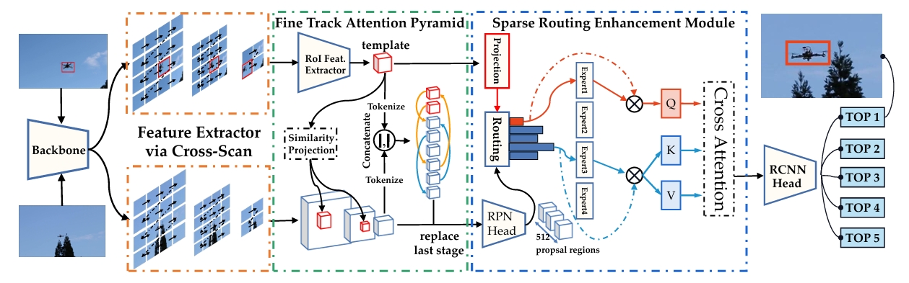
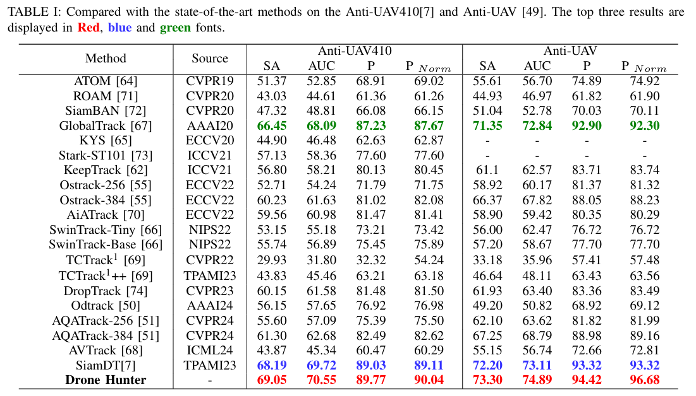
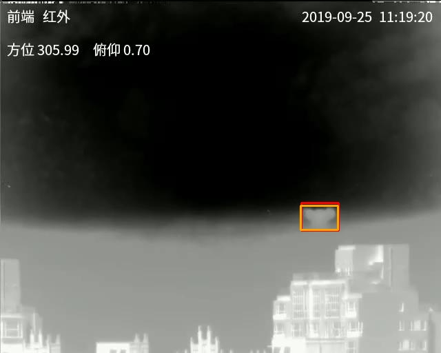
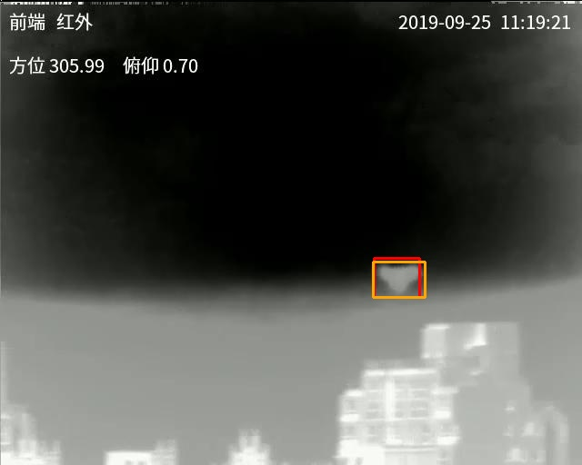
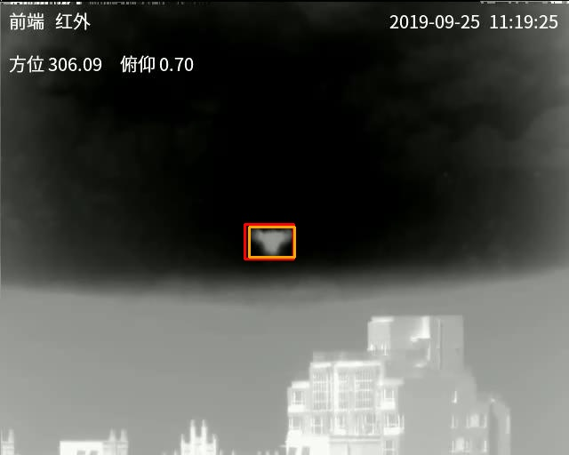
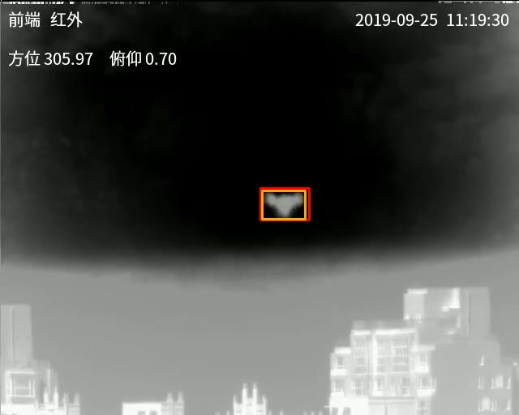
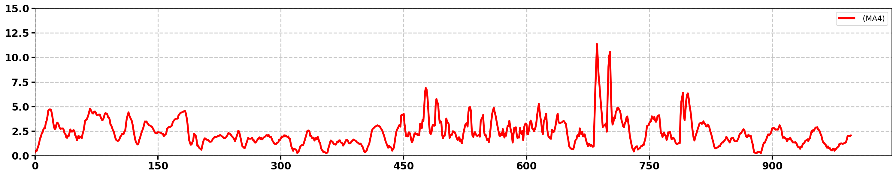
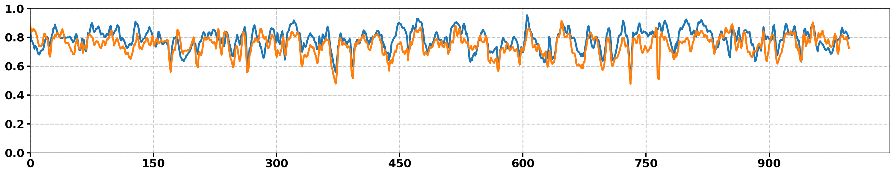

# This is the official implementation of DroneHunter


## Installation
**Step 1.** Create a conda environment and activate it.

```shell
conda create -n DroneHunter python=3.8.20
conda activate DroneHunter
```

**Step 2.** Install torch, torchvision.
```shell
pip install torch===2.1.1+cu118
pip install torchaudio==2.1.1+cu118
pip install torchvision===0.16.1+cu118
```
Other versions of python, cuda and torch are also compatible. Please refer to the installation requirements for [Vmamba](https://github.com/MzeroMiko/VMamba).

**Step 3.** Install mmcv-full.
```shell
pip install -U openmim
mim install mmcv-full
```

**Step 4.** Install other requirements.
```shell
pip install matplotlib opencv-python shapely visdom
```


**Step 6.** Prepare pre-trained models.

Download the pre-trained model at the [Vmamba project](https://github.com/MzeroMiko/VMamba), this tutorial uses Cascade Mask R-CNN framework and Vmamba-T/S backbone as an example.

1) Download 'mask_rcnn_vssm_fpn_coco_tiny_ms_3x_s_epoch_31.pth' at this [link](https://github.com/MzeroMiko/VMamba)

2) Run 'utils/obtain_pretrained_weights.py' to get the weights for backbone and neck only, and save it as a tar file for compatibility with lower versions of torch.

3) Place the 'siam_ssm_tiny.pth.tar' generated in step 2) under the 'DroneHunter/pretrained_weights/' folder path.

Note: Or you can directly download the processed pre-trained weights from the following links: [Baidu disk](https://pan.baidu.com/s/16nwy6u2MDaMmIdD3g46TDw?pwd=biad) Access code: biad)

**Step 7.** Train DroneHunter.

Change the dataset path in 'datasets/wrappers.py' and run:
```shell
python tracking_train_demo.py
```

**Step 8.** Test DroneHunter.

Change the dataset path in 'tracking_test_demo.py' and run:
```shell
python tracking_test_demo.py
```
**Framework**

<div align="center">  </div>

Figure1: Overview of Drone Hunter, which consists of Vmamba backbone, Fine Track Attention Pyramid, Scale-aware Routing Enhancement Module and RCNN detection header. First, the features of the template branch and the search branch are obtained through a Siamese feature extraction network. Subsequently, the features of the two branches are fed into FTAP separately to decouple the template information from the high semantic complexity background species. Finally, SREM is utilized to enhance the candidate information at each scale in the previous step, which in turn helps to mine the target UAV information in a bottom-up manner.

**Results**

<div align="center">  </div>

**Visualisation**

We provide two visualization methods:

I​OU (Intersection over Union) --> **Implemented in draw_iou.py**

C​LE (Center Location Error) --> **Implemented in draw_cle.py**

Below are visualization examples:

<div align="center">   <br>   </div>

<div align="center">  </div>

Figure2: Distribution of Center Location Error (CLE) across test sequences

<div align="center">  </div>

Figure3: Statistical distribution of Intersection over Union (IOU) across test sequences

